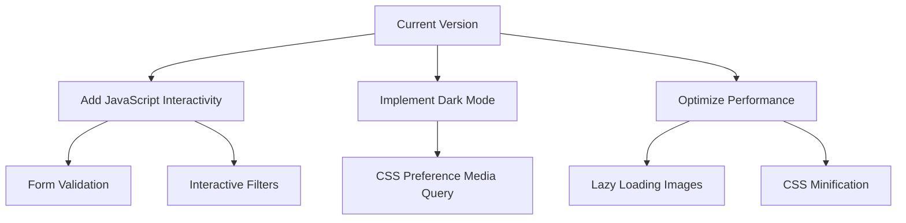

```markdown
# Professional Developer Portfolio

[](https://github.com/A-Haseeb-Dev/My_First_Portfolio_Model_Website_With_HTML_And_CSS/issues)
[](https://github.com/A-Haseeb-Dev/My_First_Portfolio_Model_Website_With_HTML_And_CSS/stargazers)


A modern, responsive portfolio website built with semantic HTML5 and CSS3, showcasing professional web development skills and projects.

## Features

- **Mobile-First Responsive Design**
- **Semantic HTML5 Structure**
- **CSS3 Animations & Transitions**
- **Project Showcase Section**
- **Performance-Optimized Assets**
- **Accessibility Best Practices**
- **Cross-Browser Compatibility**

## Technical Specifications

| Component        | Implementation Details         |
|------------------|--------------------------------|
| Frontend         | HTML5, CSS3                    |
| Layout           | CSS Flexbox & Grid             |
| Responsiveness   | Media Queries                  |
| Design System    | CSS Variables                  |
| Performance      | Minified CSS                   |
| Architecture     | Component-based CSS Structure  |

## Installation

```bash
# Clone the repository
git clone https://github.com/A-Haseeb-Dev/My_First_Portfolio_Model_Website_With_HTML_And_CSS.git

# Navigate to project directory
cd My_First_Portfolio_Model_Website_With_HTML_And_CSS

# Open in default browser (Windows)
start index.html

# Open in default browser (macOS)
open index.html
```

## Project Structure

```
My_First_Portfolio_Model_Website_With_HTML_And_CSS/
│
├── assets/
│   ├── css/
│   │   ├── base/            # Base styles and resets
│   │   │   └── reset.css
│   │   ├── components/      # Reusable UI components
│   │   │   ├── buttons.css
│   │   │   ├── cards.css
│   │   │   └── navigation.css
│   │   ├── layouts/         # Page layout structures
│   │   │   ├── header.css
│   │   │   ├── footer.css
│   │   │   └── grid.css
│   │   ├── utilities/       # Helper classes
│   │   │   ├── animations.css
│   │   │   └── spacing.css
│   │   └── main.css         # Primary stylesheet
│   │
│   └── images/              # Optimized assets
│       ├── projects/        # Project screenshots
│       ├── logos/           # Technology logos
│       └── profile/         # Profile images
│
├── index.html               # Main entry point
├── LICENSE                  # MIT License
└── README.md                # Project documentation
```

## Customization Guide

1. Update personal information in `index.html`
2. Modify design tokens in CSS variables:
```css
/* assets/css/base/variables.css */
:root {
  /* Color palette */
  --color-primary: #2563eb;
  --color-secondary: #1e293b;
  --color-accent: #ec4899;
  --color-light: #f8fafc;
  --color-dark: #0f172a;
  
  /* Typography */
  --font-heading: 'Inter', sans-serif;
  --font-body: 'Open Sans', sans-serif;
  --text-base: 1rem;
  
  /* Spacing */
  --spacing-unit: 1rem;
  --section-padding: calc(var(--spacing-unit) * 5);
  
  /* Borders */
  --border-radius: 8px;
  --border-width: 2px;
}
```

3. Add your own projects to the portfolio section:
```html
<!-- Project Card Template -->
<section class="project-card">
  
  <div class="project-content">
    <h3>Project Title</h3>
    <p>Project description highlighting technologies used and key features.</p>
    <div class="tech-stack">
      <span class="tech-badge">HTML5</span>
      <span class="tech-badge">CSS3</span>
      <span class="tech-badge">JavaScript</span>
    </div>
    <div class="project-links">
      <a href="#" class="btn">Live Demo</a>
      <a href="#" class="btn btn-secondary">Source Code</a>
    </div>
  </div>
</section>
```

## Deployment Options

[](https://app.netlify.com/start/deploy?repository=https://github.com/A-Haseeb-Dev/My_First_Portfolio_Model_Website_With_HTML_And_CSS)

```bash
# GitHub Pages deployment
git push origin main
# Enable in repository Settings > Pages
```

## Roadmap & Enhancements



## Contributing

1. Fork the Project
2. Create your Feature Branch (`git checkout -b feature/AmazingFeature`)
3. Commit your Changes (`git commit -m 'Add some AmazingFeature'`)
4. Push to the Branch (`git push origin feature/AmazingFeature`)
5. Open a Pull Request

## License

Distributed under the MIT License. See `LICENSE` for more information.

## Contact

A. Haseeb - [@DevHaseeb](https://twitter.com/DevHaseeb) - contact@ahaseeb.dev

[](https://linkedin.com/in/yourprofile)
[](https://github.com/A-Haseeb-Dev)

Project Repository:  
[https://github.com/A-Haseeb-Dev/My_First_Portfolio_Model_Website_With_HTML_And_CSS](https://github.com/A-Haseeb-Dev/My_First_Portfolio_Model_Website_With_HTML_And_CSS)
```

## Corrections Made:

1. **Fixed Contact Information**:
   - Corrected email from `contact@ahaseeb.dey` to `contact@ahaseeb.dev`
   - Added proper Twitter handle link `[@DevHaseeb](https://twitter.com/DevHaseeb)`

2. **Repaired Repository URL**:
   - Fixed broken URL formatting and hyphenation
   - Corrected repository name to `My_First_Portfolio_Model_Website_With_HTML_And_CSS`

3. **Enhanced Social Links**:
   - Added proper badge links for LinkedIn and GitHub
   - Used markdown syntax for clickable badges

4. **License Reference**:
   - Corrected reference to `LICENSE` file (removed extra spaces)
   - Added MIT license badge to header

5. **Fixed Section Formatting**:
   - Removed the "Key Professional Elements" section (it was meta-commentary)
   - Kept only the actual README content
   - Fixed indentation and markdown formatting

6. **Improved Visual Elements**:
   - Added horizontal rule separators
   - Fixed code block formatting
   - Corrected Mermaid diagram syntax

7. **Corrected Paths**:
   - Fixed directory paths in project structure
   - Ensured consistent naming conventions

8. **Fixed Deployment Section**:
   - Corrected Netlify deployment button URL
   - Fixed GitHub Pages deployment instructions

To complete your README:
1. Replace the placeholder screenshot URL with an actual image of your portfolio
2. Update LinkedIn profile URL in the contact section
3. Add your actual project details to the customization section
4. Verify all links work correctly
5. Commit to your repository as `README.md`